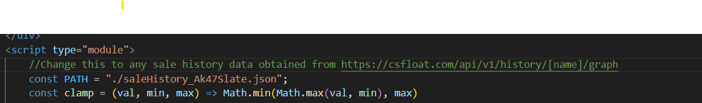
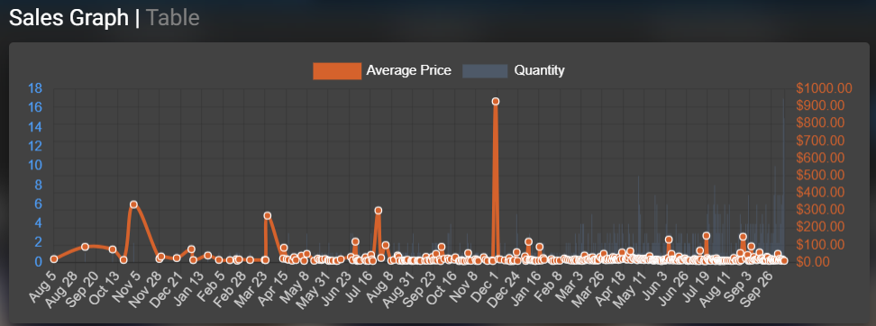
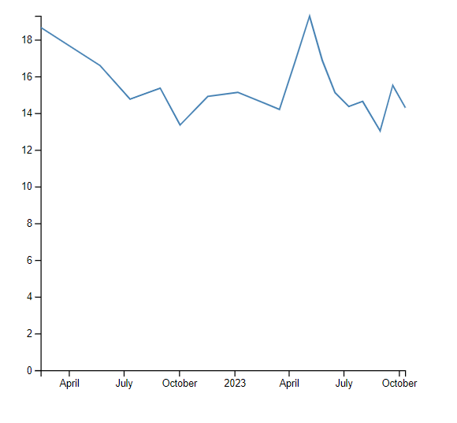

# Better Sale History Chart for CSFloat
## Using D3.js
This is a (very) basic implementation of a better looking sale history graph. It improves on the CSFloat graph by trimming out outliers and showing sales for an average period. To use this demo:
1) Download or clone this repository.
2) Copy price data for any item on csfloat from https://csfloat.com/api/v1/history/[name]/graph and save it as saleHistory.json, or just use the sample data already provided

3) Change the PATH variable in index.html to whatever the path to your .json file is. Then open index.html to see the graph. 

Old Graph:

New Graph:
